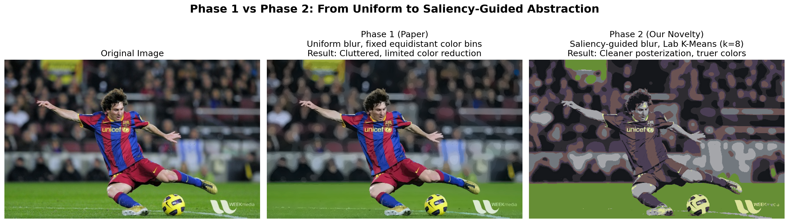
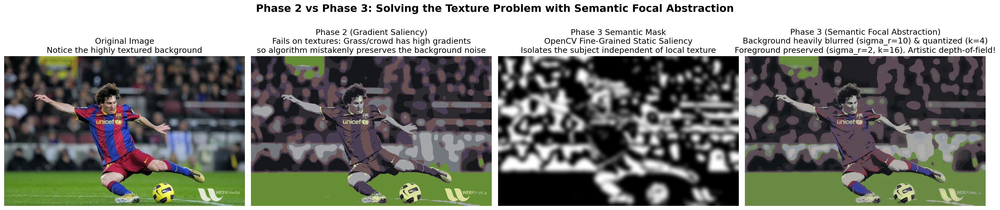
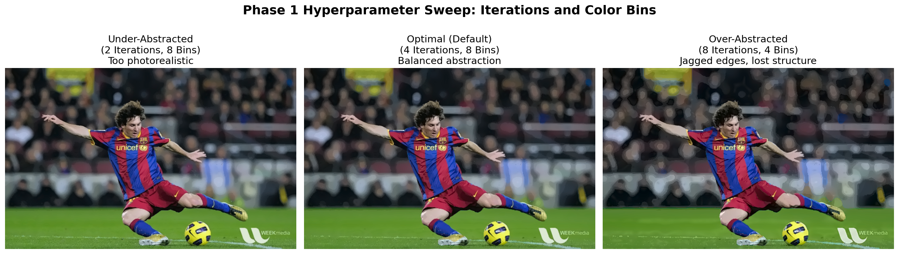
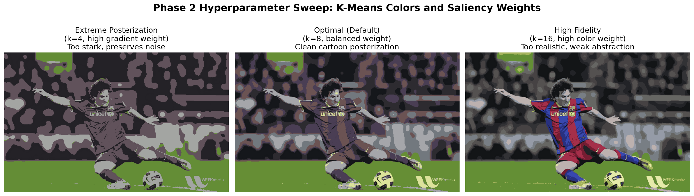
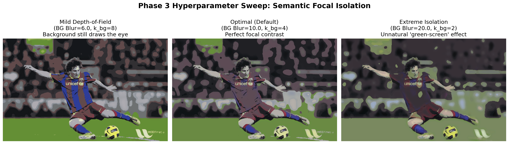

# Real-Time Perceptual Video Abstraction Using Edge-Aware Filtering and Adaptive Stylization

A multi-phase implementation and extension of Winnemoller et al. (SIGGRAPH 2006) for artistic, perceptually meaningful image abstraction.

## Live Web App
- Streamlit app: https://real-time-perceptual-video-abstraction.streamlit.app/

## Project Summary
This project starts from the original paper pipeline and then extends it with saliency- and semantic-guided abstraction.

- Phase 1: Paper-faithful abstraction pipeline
- Phase 2: Novel saliency-guided abstraction and adaptive quantization
- Phase 3: Semantic focal abstraction for stronger foreground/background style control

Primary goals:
- Preserve important structure (subject boundaries, dominant edges)
- Remove perceptual clutter (background texture/noise)
- Produce controllable stylized output with quantitative and qualitative evaluation

## Visual Results

### Phase Progression




### Hyperparameter Sweeps






## Phase-Wise Method

### Phase 1: Paper Implementation
- Iterative bilateral abstraction in Lab color space
- Difference-of-Gaussians edge extraction
- Soft color quantization
- Stylized edge overlay

Output: faithful baseline matching the original method behavior.

### Phase 2: Novelty Layer
- Saliency-guided adaptive bilateral filtering
- Adaptive K-means quantization in Lab
- Better control over detail preservation vs simplification

Output: cleaner and more controllable stylization than fixed uniform processing.

### Phase 3: Deep Semantic Layer
- Semantic saliency mask for subject-aware processing
- Separate foreground/background abstraction strengths
- Strong focal effect for visual emphasis on the subject

Output: improved subject prominence and cinematic abstraction style.

## Repository Structure
```text
.
|-- app.py
|-- generate_final_comparisons.py
|-- generate_hyperparam_comparisons.py
|-- run_experiments.py
|-- requirements.txt
|-- phase1_paper_implementation/
|   |-- bilateral_abstraction.py
|   |-- dog_edges.py
|   |-- pipeline.py
|   `-- soft_quantization.py
|-- phase2_novelty/
|   |-- adaptive_quantization.py
|   |-- enhanced_pipeline.py
|   `-- saliency_guided.py
|-- phase3_deep_semantic/
|   |-- semantic_pipeline.py
|   `-- semantic_saliency.py
|-- report/
|   `-- report.tex
`-- results/
    |-- comparison_1_P1_vs_P2.png
    |-- comparison_2_P2_vs_P3.png
    `-- experiments/
```

## Installation
```bash
git clone https://github.com/Jay-salot-2210/Real-Time-Perceptual-Video-Abstraction-using-Edge-Aware-Filtering-and-Adaptive-Stylization.git
cd Real-Time-Perceptual-Video-Abstraction-using-Edge-Aware-Filtering-and-Adaptive-Stylization
python -m venv venv
venv\Scripts\activate
pip install -r requirements.txt
```

## Run Locally

### 1) Streamlit Web App
```bash
streamlit run app.py
```

### 2) Regenerate Main Comparison Figures
```bash
python generate_final_comparisons.py
```

### 3) Regenerate Hyperparameter Sweep Figures
```bash
python generate_hyperparam_comparisons.py
```

### 4) Run Experiment Script
```bash
python run_experiments.py
```

## Web App Controls (What Each Slider Does)
- Iterations: more passes means stronger abstraction and flatter regions
- Spatial Sigma (sigma_d): larger neighborhood smoothing influence
- Foreground Detail (sigma_r_fg): lower values preserve subject texture/details
- Background Blur (sigma_r_bg): higher values simplify background aggressively
- Foreground Colors (k_fg): larger values keep more subject color richness
- Background Colors (k_bg): lower values create stronger posterized backgrounds
- Edge Sigma (sigma_e): controls edge scale/coarseness
- Foreground Edge Strength: outline strength on subject
- Background Edge Strength: outline strength on background

## Applications
- Creative photo and video stylization
- AR/VR pre-processing for scene simplification
- Bandwidth-conscious visual communication
- Pre-attentive visualization (focus guidance)
- Educational demos for edge-preserving filtering and NPR

## Quantitative Evaluation
Metrics used in this project include:
- PSNR
- SSIM
- Runtime/performance observations
- Visual qualitative analysis across parameter sweeps

## Deployment Notes
This project uses `opencv-contrib-python-headless` in `requirements.txt` to support:
- `cv2.saliency` module availability
- Linux cloud deployment without GUI/OpenGL system dependency issues

## Report
Detailed methodology, experiments, and analysis are in:
- `report/report.tex`

## Reference
Winnemoller, H., Olsen, S. C., and Gooch, B. (2006).
Real-Time Video Abstraction.
ACM SIGGRAPH.
